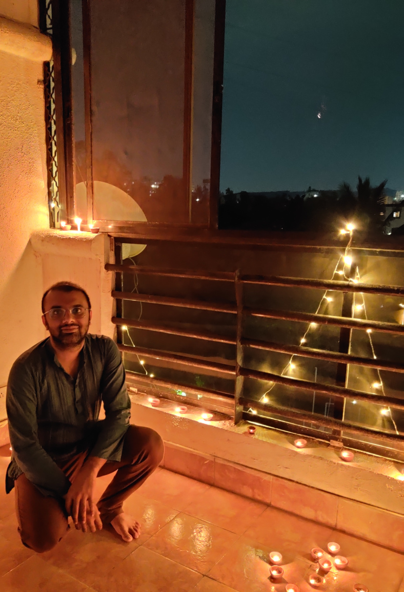

# Joy Merwin Monteiro

  
    
  Department of Earth and Climate Science, 
  IISER Pune, Dr. Homi Bhabha Road, 
  Pashan, Pune : 411008, INDIA.  
  

  

## About
We aim to be a curiosity-driven group exploring different aspects of weather and climate.
We use a wide range of approaches -- theoretical, computational and observational -- to study
phenomena that we find fascinating. We enjoy working on idealised, abstract questions as well
as applied, socially relevant ones.

We are extremely interested in interdisciplinary research, and encourage looking at questions
from a broader perspective.

## Current interests
We are currently interested in the following themes:
* A fundamental understanding of heat stress events in South Asia.
* [New approaches](https://github.com/CliMT/climt) to climate modelling.
* Rossby wave packets and their role in shaping South Asian climate.

## Positions available
I am actively looking to work with students interested delve deeper into climate
science. I encourage students to find questions that they find motivating. 

If you  are interested to work with me,
it is best if you contact me as early as possible to discuss questions of mutual interest.

[Take a look](https://scholar.google.com/citations?user=bMU4QficRmcC&hl=en) at my publications
and see if any topics interest you!

## Teaching
Please find the online lectures [here](./ecs323.md) for the Applied Math Methods course ECS323.
